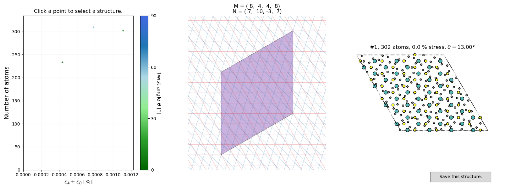

# Hetbuilder - builds heterostructure interfaces

[](https://doi.org/10.5281/zenodo.4721346)
[](https://hetbuilder.readthedocs.io/en/latest/?badge=latest)

Builds 2D heterostructure interfaces via coincidence lattice theory.

## Installation

Requires a C++17 compiler, [cmake](https://cmake.org/) at least with version 3.18.4, as well as [spglib](https://atztogo.github.io/spglib/python-spglib.html) and [pybind11](https://github.com/pybind/pybind11). 
All can be installed with Anaconda:

```bash
conda install -c conda-forge cxx-compiler git pip cmake spglib pybind11
```

Then you can directly install from git:

```bash
pip install git+https://github.com/romankempt/hetbuilder.git
```

## First steps

The installation exposes a single [typer](https://github.com/tiangolo/typer) CLI utility called `build_heterostructure`:

```bash
build_heterostructure --help
```

You can use any ASE-readable structure format to specify the lower and upper layer. They should be recognizable as two-dimensional, e.g., by having a zero vector in the *z*-direction.

```bash
build_heterostructure graphene.xyz MoS2.cif
```

This should open a [matplotlib](https://matplotlib.org/) interface looking like this:



## Documentation

Documentation is available at [Read the Docs](https://hetbuilder.readthedocs.io/en/latest/index.html).

## Testing

Tests can be run in the project directory with

```bash
pytest -v tests
```

## Citing

If you use this tool, please cite 10.5281/zenodo.4721346.

## Requirements

- [Atomic Simulation Environment](https://wiki.fysik.dtu.dk/ase/)
- [Space Group Libary](https://atztogo.github.io/spglib/python-spglib.html)
- [SciPy](https://www.scipy.org/)
- [matplotlib](https://matplotlib.org/)
- [pybind11](https://github.com/pybind/pybind11)
- [typer](https://github.com/tiangolo/typer)
