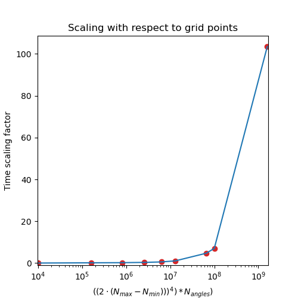

# Command-line interface

The options of the CLI utility `build_heterostructure` can be shown via:

```bash
build_heterostructure --help
```

In the following, a couple of examples are shown to illustrate different parameter choices.

## Searching specific angles

Specific angles can be passed explicitly with the `-a` option and can be called multiple times:

```bash
build_heterostructure a.xyz b.xyz -a 0.15 -a 20.4 -a 30.1
```

This takes precedence over the specification of angles via the angle limits and the angle stepsize.

## Reducing the angle range

If both layers are highly symmetric, e.g., both have a hexagonal $C_6$ rotation axis, then it does not make sense to search through the entire range between 0 and 90°. It is sufficient in this case to look for angles in the range between 0 and 30°, e.g., with a stepsize of 0.5°:

```bash
build_heterostructure a.xyz b.xyz -al 0 30 -as 0.5
```

## Changing the number of translations

The maximum and minimum number of translations $N_{max}$ and $N_{min}$ are the most performance-relevant parameters. Choosing a large number of translations (e.g., 100) is possible but leads to longer run times. In this case, it might help to make more OpenMP threads available by setting the environment variable `OMP_NUM_THREADS` to a larger value.

Usually, one is interested in the smallest coincidence cell possible with small allowed strain. For most practical purposes, $N_{max}$ is set to $10$ because of that.

Choosing large values for both is useful if one wants to look for very large supercells. For example:

```bash
build_heterostructure a.xyz b.xyz --Nmin 100 --Nmax 125
```

But other parameters might need adjustment for that purpose as well, such as the tolerance. Accessing these large structures via the matplotlib interface might be problematic, so it is recommended to search for these large supercells via the python interface.



## Changing the tolerance

The tolerance corresponds to a distance between lattice points in Angström. Choosing a larger tolerance accepts more lattice points and generates more supercells, but these might have a larger total lattice mismatch.

```bash
build_heterostructure a.xyz b.xyz -t 0.2
```

## Changing the weight factor

Changing the weight factor $w$ only affects the out-comping coincidence supercells, not the results algorithm itself. A weight factor $w=0$ means that the coincidence unit cell is given only be the supercell of the lower layer. A weight factor $w=1$ means that the coincidence unit cell is given only be the supercell of the upper layer. Correspondingly, this allows to remove stresses from one of the layers at expense of the other.

```bash
build_heterostructure a.xyz b.xyz -w 0
```